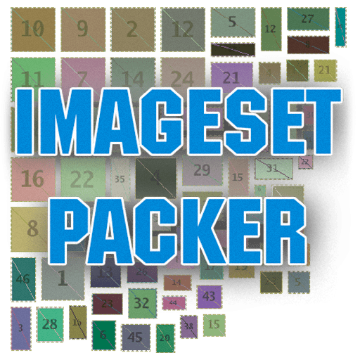
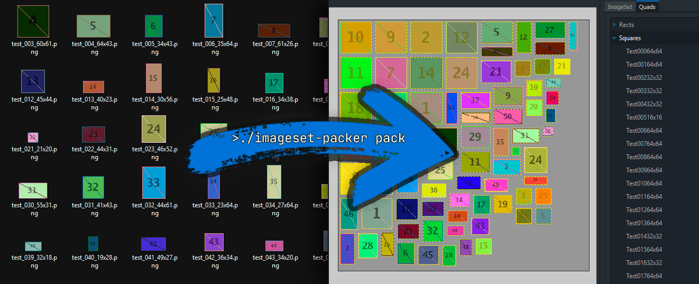

# ImageSet Packer

<!-- markdownlint-disable-next-line MD033 -->


**imageset-packer** is a CLI tool for building DayZ `.imageset` + `.edds`
from folders with PNG/TGA/TIFF/BMP files.  
It replaces the routine manual atlas creation in Workbench:
just organize your source images into folders, run `pack`,
and you get correct placement, good atlas density,
and ready-to-use files for your DayZ mod.

<!-- markdownlint-disable-next-line MD033 -->
## Main commands <br clear="right"/>

Help for available commands

```bash
imageset-packer -h
```

Help for flags of a specific command

```bash
imageset-packer pack -h
```

### `pack`



Packs a folder of images into a single atlas (`.edds`) and
a `.imageset` description file.

Examples:

```bash
imageset-packer pack ./icons
```

Packs `./icons` into `icons.imageset` + `icons.edds` in the same folder.

```bash
imageset-packer pack ./icons ./out -x 3 -g 2 -f -P mod/data/images
```

Packing with 3 mipmap levels, 2px gap, overwrite enabled,
and the texture path set in the imageset.

```bash
imageset-packer pack ./icons -F dxt5 -q 8
```

Packing with DXT-compressed output format and explicit encoder quality.

```bash
imageset-packer pack ./icons --skip-unchanged
```

Skips writing if the input files have not changed.

> [!TIP]  
> `--skip-unchanged` is useful for local builds and CI.
> A small `.imagehash` file is created next to the outputs.

### `build`

Runs multiple packing tasks from a YAML config. Useful for CI and automation.  
The `.imageset-packer.yaml` file is recommended at the project root.
A detailed example can be [found here](.imageset-packer.example.yaml).

```bash
imageset-packer build
```

Builds all projects from `.imageset-packer.yaml`.

### `unpack`

Migration helper.
Splits an existing project `.imageset` + `.edds` into separate images.  
This lets you convert an old atlas into a folder structure
and switch to `imageset-packer` as the main tool.

```bash
# Extracts images and splits groups into subfolders.
imageset-packer unpack ui.imageset ui.edds --groups
```

### `convert`

Helper utility for converting a single file between
PNG/TGA/TIFF/BMP/DDS/EDDS formats.

Example:

```bash
# EDDS to PNG, file type is determined by the extension
imageset-packer convert atlas.edds atlas.png
```

```bash
# PNG to EDDS with explicit format/quality
imageset-packer convert icon.png icon.edds -F dxt1 -q 8 -x 1
```

## Build automation

Simple `.imageset-packer.yaml` example.

```yaml
# .imageset-packer.yaml
projects:
  - name: hud
    args:
      input_dir: ./images/hud
      output_dir: ./data/images
    edds_path: mod/data/images
    camel_case: true
    force: true
    skip_unchanged: true
    packing:
      gap: 2
      mipmaps: 1
      output_format: bgra8
      quality: 0
    input:
      group_dirs: true

  - name: ui
    args:
      input_dir: ./images/ui
      output_dir: ./data/images
    edds_path: mod/data/images
    camel_case: true
    force: true
    skip_unchanged: true
    packing:
      gap: 2
      mipmaps: 2
      output_format: dxt5
      quality: 8
    input:
      group_dirs: true
```

Detailed example file: [.imageset-packer.yaml](.imageset-packer.example.yaml).

<!-- markdownlint-disable-next-line MD033 -->
<details><summary>Advanced example with anchors and reuse (4 atlases)</summary>

```yaml
# .imageset-packer.yaml
defaults: &defaults
  edds_path: mod/data/images
  camel_case: true
  force: true
  skip_unchanged: true
  packing: &packing
    gap: 2
    mipmaps: 1
    output_format: bgra8
    quality: 0
  input: &input
    group_dirs: true

projects:
  - name: chars
    args:
      input_dir: ./chars
      output_dir: ./out
    <<: *defaults

  - name: ui
    args:
      input_dir: ./ui
      output_dir: ./out
    <<: *defaults
    packing:
      <<: *packing
      mipmaps: 2

  - name: markers
    args:
      input_dir: ./markers
      output_dir: ./out
    <<: *defaults

  - name: hud
    args:
      input_dir: ./hud
      output_dir: ./out
    <<: *defaults
    packing:
      <<: *packing
      mipmaps: 2
```

<!-- markdownlint-disable-next-line MD033 -->
</details>

## Recommendations

* Keep a clear folder structure and stable file names.
* Supported atlas formats: `bgra8`, `dxt1`, `dxt5`.
* Default atlas output is `bgra8` (`DXGI_FORMAT_B8G8R8A8_UNORM`).
* DXT quality uses `0..10`
  (`0` = library optimal default, `1` fastest, `8` high quality).
* For UI icons and UI parts, avoid long mipmap chains:
  usually **1-4 levels** are enough.
* If the build is automated and `.imageset`/`.edds` artifacts are not
  in `.gitignore`, enable `force` to ensure files are overwritten.  
* For frequent local runs, use `skip_unchanged` to avoid noisy commits.
  The hash is stored in `.imagehash`; add these files to `.gitignore`
  if desired, especially if source images are not tracked.  
* For UI elements, `gap` is useful when mipmaps are enabled and
  there are many small elements. Usually `2-6` is enough,
  but it reduces atlas density.
  This option is not required, but it can help if
  neighboring elements bleed into the current element when scaled.

## Known behavior and fixes

> [!CAUTION]  
> `--skip-unchanged` considers **only the contents of input files**.
> If you change packing parameters (gap/mipmaps/path, etc.),
> run without `--skip-unchanged` or delete `.imagehash`.

---

> [!WARNING]  
> Windows + MSYS2/Git Bash may require disabling path conversion for
> `--edds-path`:
>
> ```bash
> MSYS2_ARG_CONV_EXCL='--edds-path;-P' go run ./cmd/imageset-packer/ pack ...
> ```

## 👉 [Support Me](https://gist.github.com/WoozyMasta/7b0cabb538236b7307002c1fbc2d94ea)
